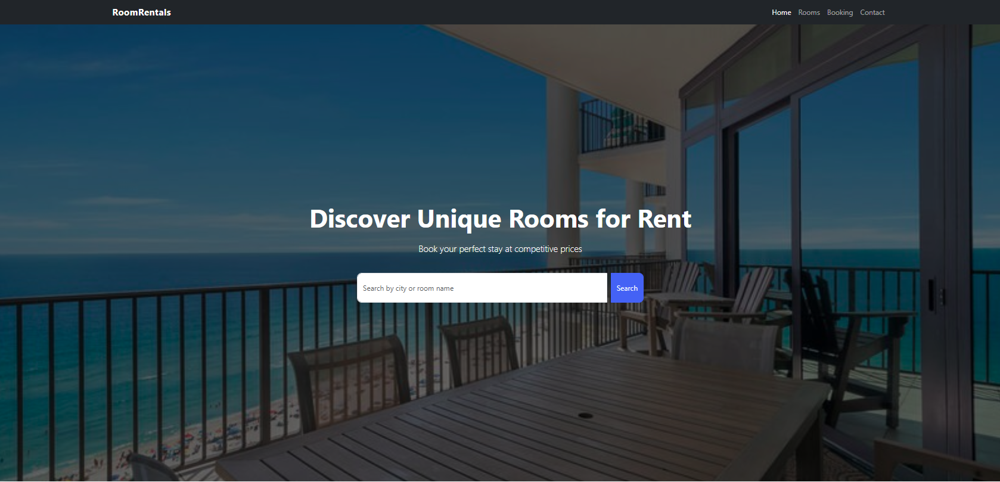

# Room-Rentals

UI / UX for Room Rentals Page for Booking



Please click here to [view live demo](https://room-rentals-nu.vercel.app/)

---

## Overview

Room-Rentals is a modern, responsive room rental and booking user interface designed to showcase available rooms and provide users with a smooth browsing experience. The project focuses on clean UI/UX design, mobile responsiveness, and scalability for future booking or backend integrations.

This project serves as a strong frontend foundation for real-world accommodation, rental, or property booking platforms.

---

## Table of Contents

* [Features](#features)
* [Project Structure](#project-structure)
* [Technology](#technology)
* [Installation](#installation)
* [Credits](#credits)
* [License](#license)

---

## Features

* Modern and clean UI design
* Responsive layout for mobile, tablet, and desktop
* Room listing cards with pricing and details
* Call-to-action booking buttons
* Scalable layout ready for backend integration

---

## Project Structure

```
Room-Rentals/
│
├── index.html
├── style.css
├── Screenshot.png
├── License
└── README.md
```

---

## Technology

* HTML5 – Semantic structure
* CSS3 – Custom styling and animations

---

## Installation

1. Clone the repository:

   ```bash
   git clone https://github.com/your-username/Room-Rentals.git
   ```
2. Open the project folder
3. Run `index.html` in your browser

No additional setup is required.

---

## Credits

This project was created for learning, UI/UX practice, and portfolio demonstration purposes.

---

## License

This project is open-source and available under the MIT License.
